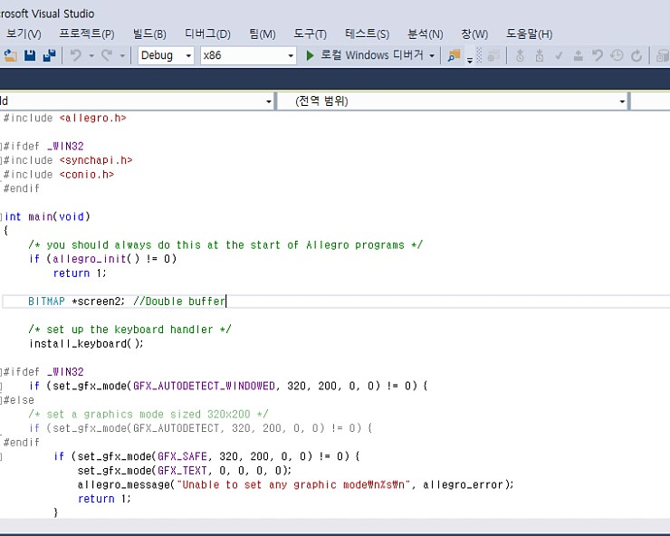
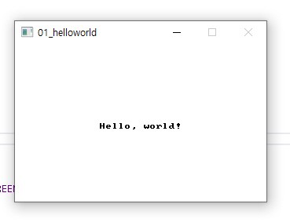
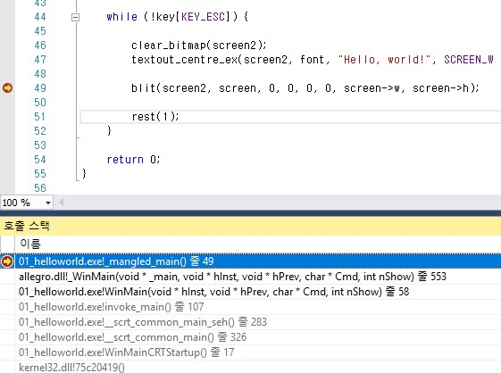
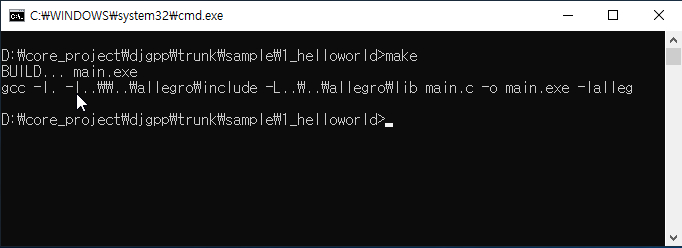
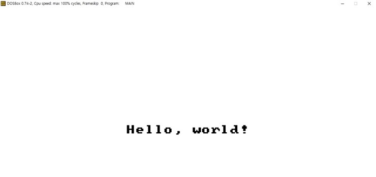

# allegro4_dos
dos / win32 cross platform development environment

1. Purpose  
  The purpose of this system is to make an app that works easily and conveniently in DOS. 
  There are Watcom C / C ++ and Trubo C ++ that allow DOS programs to be created. 
  However, I think that creating programs with DOS-style coding style is going to reverse the times. 
  WIN32 / DOS Programming complete system allows you to use the C/C++ language 
  while developing with Visual Studio, the most powerful IDE on the Windows operating system. 
  Of course, there are some limitations, but if you are able to create DOS programs with the latest methods 
  and if DOS programs come out one by one, I think DOS will continue to maintain its vitality.

2. WIN32 / DOS Programming Complete System Features
 - Create programs that run on WIN32 and DOS as one source
 - Program development with Visual Studio 2017
 - Visual Studio 2017 enables proactive debugging and app tuning
 - Create DOS binaries via DJGPP and test your app with DOSBox

  If you are familiar with programming, 
you do not have to worry about the DOS platform.
 and You can easily create a DOS program.

3. Sample Source
 - There are a few sample sources in the system, and we will continue to add samples in the future.
 
 
  |     PROJECT  |  	WIN32      | DOS   |
|:-:|:-:|:-:|
|  HELLO WORLD | 100%  | 100%  |
|  PONG |  100% | 100%  |
|   RA2|  100% | 100%  |
|  TETRIS | 100%  | Resolution problem  |
| EAGLE GUI  | 100%  | Resolution problem  |
| BOAT RAGE  | Executable  | problem |
| STRIKER  | Logic Bug  | Resolution problem  |
| SHOOTER  | 100%  | 100%  |
| SKATER   | 100%  | 100%  |
| TBENGINE  | 100%  | Resolution problem  |
| DONKEY  | 100%  | Resolution problem  |
| CHESS   | BUG  | problem  |
| TANK  | 100%  |   |
| HORACIO  | 100%  |   |
| WINADV  | 100%  |   |
| FOX RANGER  | 100%  | 100%  |

We have outlined the WIN32 / DOS programming complete system. 
So this system may not be feeling well yet. 
Let's take a look at some examples before we explain how to use them.

4. Development Procedure
 - Program development with visual studio

- Build and Run

- Bug fixes and debugging as much as possible in WIN32

After completing this test, we will now create the DOS binary.

- Source code build with DJGPP

- Final check through DOSBox

If you've been to this point, 
I think you understand the concept of this system.
If you are interested in creating a DOS program, believe it and try it out.
Please do not worry if you are in trouble, we can help you anytime.